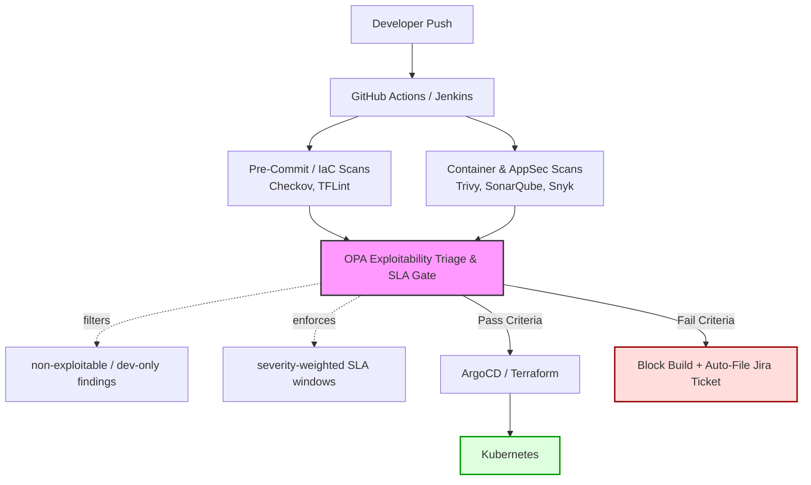
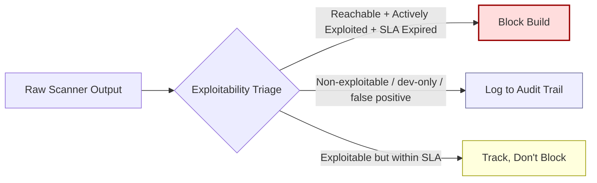
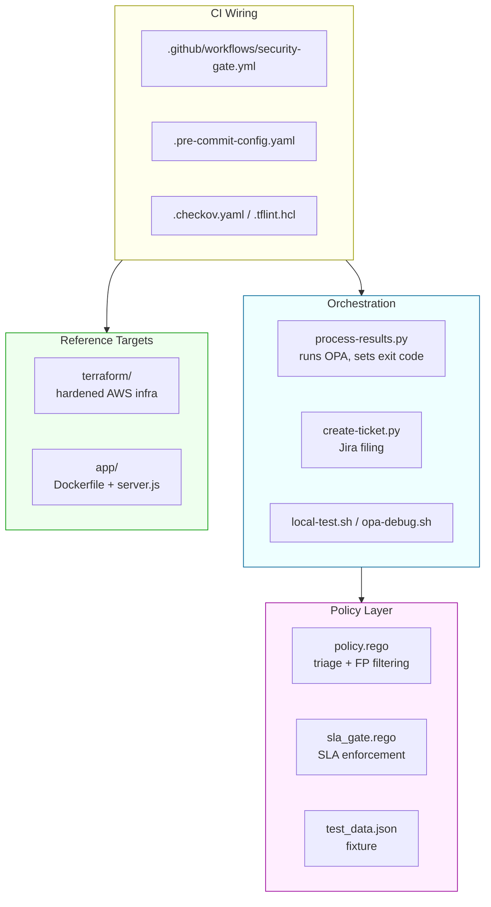
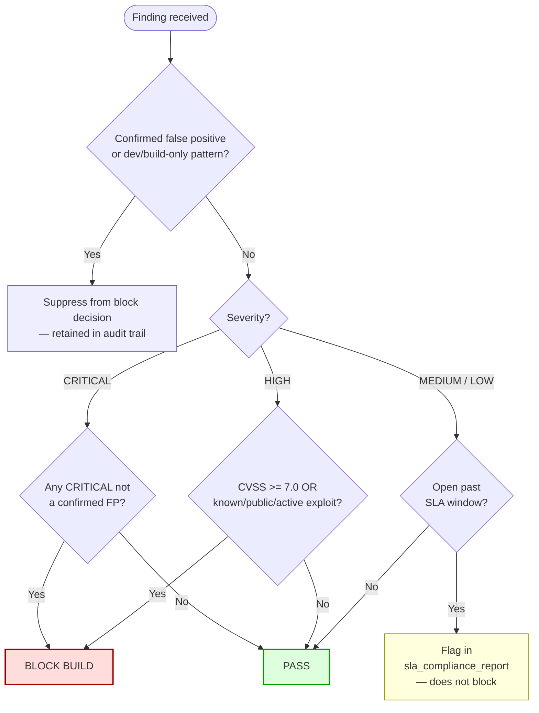
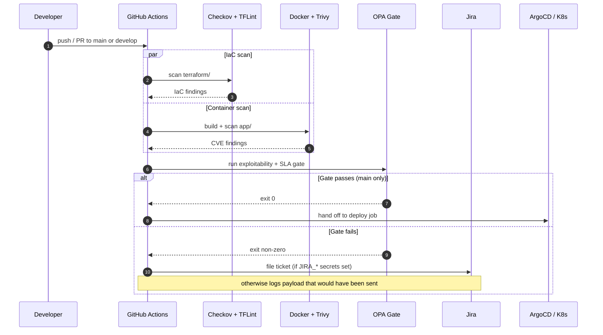

# Enterprise Shift-Left CI/CD & Governance Gateway

A centralized security gating framework that filters vulnerability noise by **exploitability** rather than raw alert volume, enforces severity-weighted SLA windows, and blocks unverified builds before they reach production Kubernetes — without burying developers in false positives.

Designed against a target environment of 120+ repositories and 18 CI/CD pipelines.

---

## The Problem

Rolling out security scanning across dozens of repositories is rarely a tooling problem — it's a trust problem. If a build breaks on a low-risk, non-exploitable finding, developers learn to route around the gate instead of fixing what matters. That erodes the control entirely.

This project resolves that by inserting an **Open Policy Agent (OPA) triage layer** between raw scanner output and the pass/fail decision, so only findings with a real exploit path and an expired SLA window actually block a build.

## Architecture



### Threat model this addresses

| Threat | Control that stops it |
|---|---|
| **Unauthorized commit bypasses** — merges that skip local validation and land misconfigured IaC on `main` | Pre-commit gate + CI pipeline |
| **Unverified container images** — untagged or unscanned base images entering the build path | Trivy scan step in CI |
| **Configuration drift** — permissive IAM roles, public S3 buckets, open ingress rules reaching production | Checkov + TFLint + OPA gate |
| **SLA drift** — known-exploitable CVEs aging past their remediation window due to fragmented tracking | `sla_gate.rego` + Jira auto-filing |

### Why exploitability, not CVSS volume

Gating on raw CVE count or CVSS score alone produces high theoretical coverage but crushes throughput — most flagged CVEs are unreachable in practice (test-only dependencies, unexercised code paths, already-patched transitive deps). The OPA layer instead asks: *is this reachable, is it actively exploited, and has it been open too long?* Findings that fail all three are still logged (for audit) but don't block the pipeline.



**Impact (target metrics for this framework):** ~42% reduction in false-positive pipeline noise; mean time to remediate down from 21 days to 9 days.

## Repository layout



```
.
├── .github/workflows/security-gate.yml   # CI pipeline: IaC scan → container scan → OPA gate → deploy
├── policies/
│   ├── policy.rego                       # Exploitability triage + false-positive filtering
│   ├── sla_gate.rego                     # Severity-weighted SLA enforcement
│   └── test_data.json                    # Sample scan payload for local testing
├── scripts/
│   ├── process-results.py                # Runs OPA, renders the triage report, sets exit code
│   ├── create-ticket.py                  # Files a Jira ticket on gate failure (env-var driven)
│   ├── local-test.sh                     # One-shot local pipeline dry run
│   └── opa-debug.sh                      # Rego syntax check + raw policy query
├── terraform/
│   ├── main.tf                           # Reference AWS infra (hardened: private, encrypted, least-privilege)
│   └── variables.tf
├── app/
│   ├── Dockerfile                        # Reference container for Trivy scanning
│   ├── package.json
│   └── server.js
├── .checkov.yaml                         # Checkov ruleset
├── .tflint.hcl                           # TFLint ruleset
├── .pre-commit-config.yaml               # Local pre-commit IaC gate
└── .gitignore
```

## Policy logic

`policies/policy.rego` and `policies/sla_gate.rego` share the `devsecops.triage` package and are loaded together by OPA:



- **Blocking rule:** a `CRITICAL` finding blocks unless every `CRITICAL` in the batch is a confirmed false positive; a `HIGH` finding blocks only if it's also exploitable (`cvss_score >= 7.0`, or a known/public/active exploit flag is set).
- **Noise filtering:** findings matching patterns like `"dev dependency only"`, `"test dependency only"`, or `"build-time only"` in their description, or explicitly flagged `false_positive: true`, are suppressed from the block decision — but retained in the audit trail via `noise_statistics` and `violation_report`.
- **SLA enforcement:** each severity gets its own remediation window. Anything open past its window shows up in `sla_compliance_report.violations_detail`.

| Severity | SLA Window |
|---|---|
| CRITICAL | 3 days |
| HIGH | 7 days |
| MEDIUM | 14 days |
| LOW | 30 days |

## Running locally

Prerequisites: [OPA](https://www.openpolicyagent.org/docs/latest/#running-opa), Python 3.9+, Docker (optional, for the container scan step), [Checkov](https://www.checkov.io/2.Basics/Installing%20Checkov.html) and [TFLint](https://github.com/terraform-linters/tflint) (optional, for the IaC steps).

```bash
# 1. Validate policy syntax and run a raw OPA query
bash scripts/opa-debug.sh

# 2. Run the full triage gate against the bundled test fixture
python3 scripts/process-results.py

# 3. Or run the whole local pipeline in one shot
bash scripts/local-test.sh
```

Expected result against the bundled `policies/test_data.json`: the gate **blocks**, because it contains one unmitigated `CRITICAL` (`CVE-2021-12345`, active exploit, 12 days open against a 3-day SLA), while the `HIGH` and `MEDIUM` findings are correctly suppressed as dev/build-only false positives.

To test against your own scan output, point the script at a different payload:

```bash
python3 scripts/process-results.py path/to/your-scan-results.json
```

### IaC and container checks

```bash
tflint --init && tflint terraform/
checkov --config-file .checkov.yaml -d terraform/
docker build -t devsecops-gateway:local ./app
trivy image devsecops-gateway:local
```

## CI/CD pipeline

`.github/workflows/security-gate.yml` runs on every push/PR to `main`/`develop`:



1. Checkov + TFLint against `terraform/`
2. Docker build + Trivy scan of `app/`
3. OPA syntax check, then the exploitability + SLA gate via `process-results.py`
4. On failure: files a Jira ticket (`create-ticket.py`) if `JIRA_*` secrets are configured; otherwise logs the payload that would have been sent
5. On success (on `main`): hands off to the deploy job, representing the ArgoCD/GitOps sync to Kubernetes

Required repo secrets for full Jira integration: `JIRA_BASE_URL`, `JIRA_EMAIL`, `JIRA_API_TOKEN`, `JIRA_PROJECT_KEY`. Without them, the gate still runs and blocks correctly — it just skips the live ticket.

## Extending this project

- Swap `test_data.json` for real Trivy/Snyk/SonarQube JSON output, normalized to the schema in `policies/policy.rego`.
- Add a Jenkins `Jenkinsfile` alongside the GitHub Actions workflow for hybrid pipeline environments.
- Add ArgoCD `Application` manifests under a `gitops/` directory to complete the deploy job.
- Tune `excluded_packages`, `false_positive_patterns`, and per-severity SLA windows in `policies/` to match organizational risk tolerance.

## License

MIT — see [LICENSE](LICENSE).