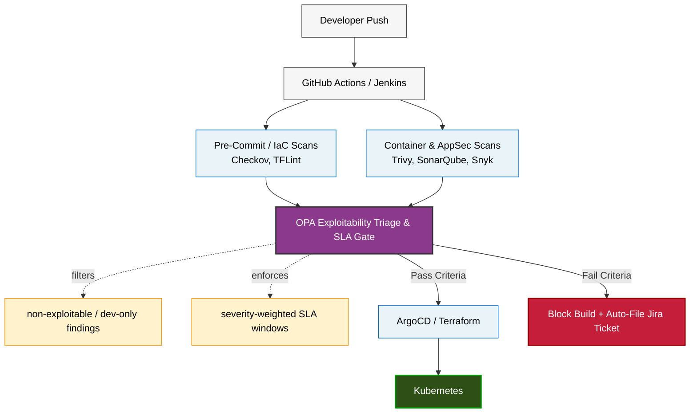
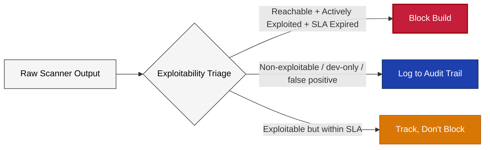
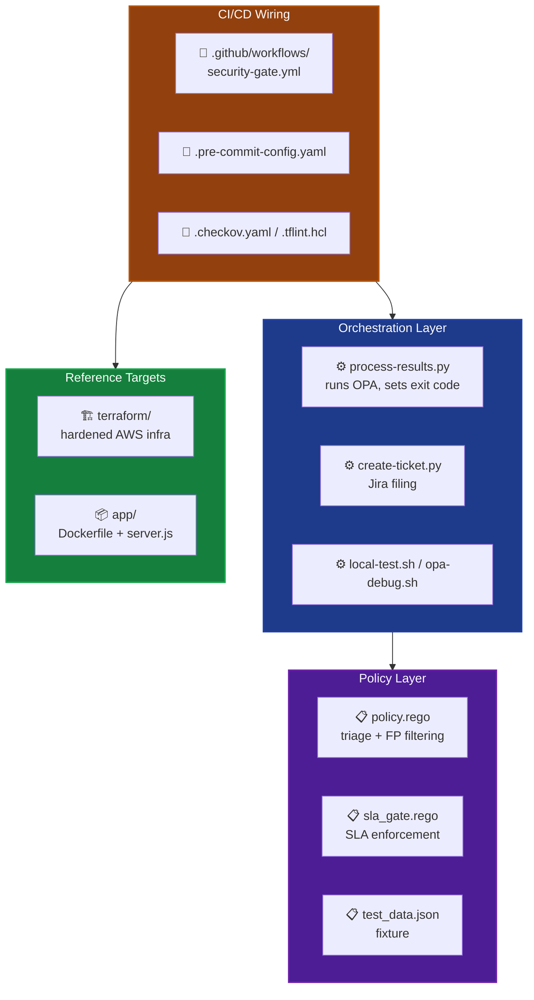
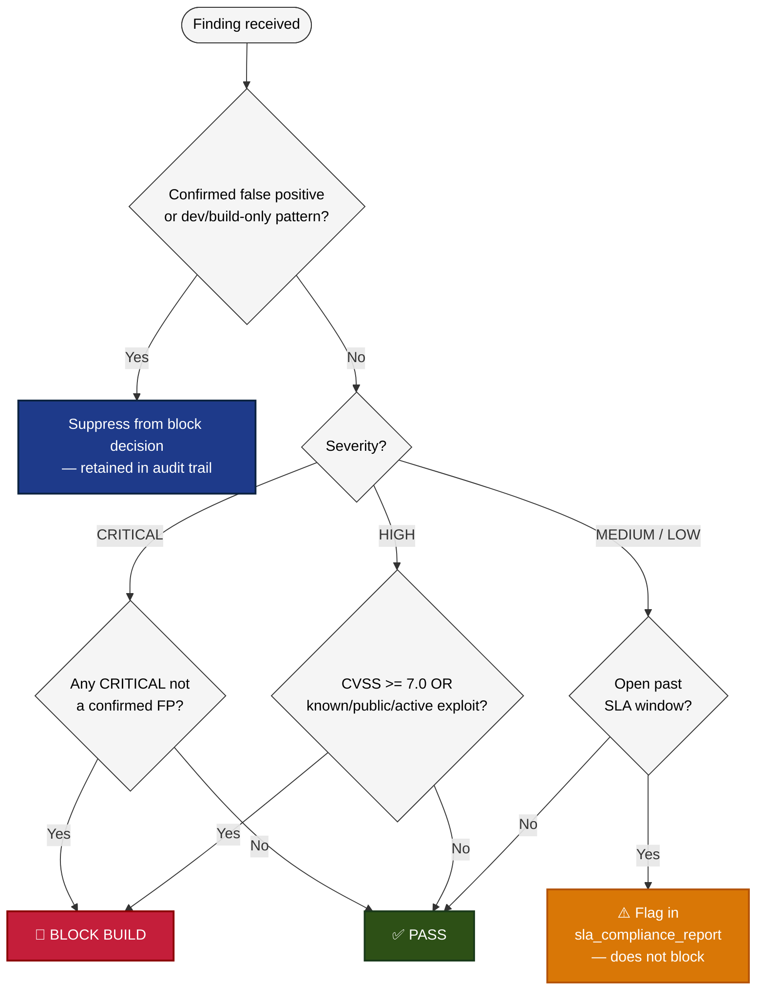
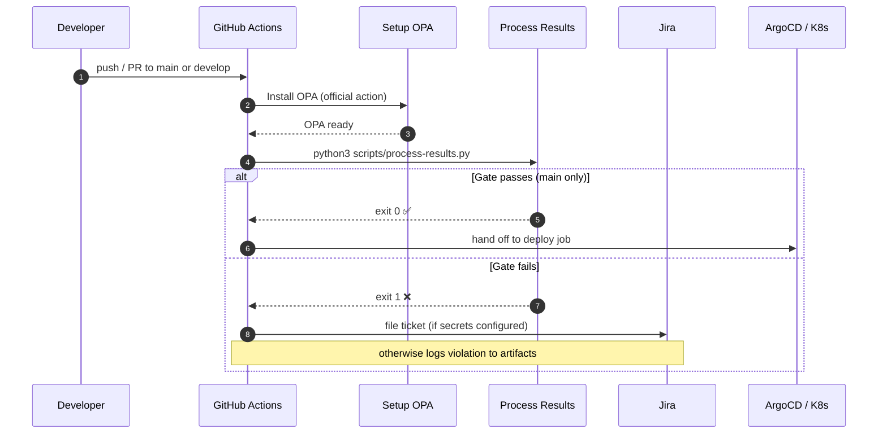

# Enterprise Shift-Left CI/CD & Governance Gateway

A centralized security gating framework that filters vulnerability noise by **exploitability** rather than raw alert volume, enforces severity-weighted SLA windows, and blocks unverified builds before they reach production Kubernetes — without burying developers in false positives.

Designed against a target environment of 120+ repositories and 18 CI/CD pipelines.

---

## The Problem

Rolling out security scanning across dozens of repositories is rarely a tooling problem — it's a trust problem. If a build breaks on a low-risk, non-exploitable finding, developers learn to route around the gate instead of fixing what matters. That erodes the control entirely.

This project resolves that by inserting an **Open Policy Agent (OPA) triage layer** between raw scanner output and the pass/fail decision, so only findings with a real exploit path and an expired SLA window actually block a build.

## Architecture


```mermaid
flowchart TD
    A[Developer Push] --> B[GitHub Actions / Jenkins]

    B --> C[Pre-Commit / IaC Scans<br/>Checkov, TFLint]
    B --> D[Container & AppSec Scans<br/>Trivy, SonarQube, Snyk]

    C --> E[OPA Exploitability Triage & SLA Gate]
    D --> E

    E -.->|filters| E1[non-exploitable / dev-only findings]
    E -.->|enforces| E2[severity-weighted SLA windows]

    E -->|Pass Criteria| F[ArgoCD / Terraform]
    F --> G[Kubernetes]

    E -->|Fail Criteria| H[Block Build + Auto-File Jira Ticket]

    style E fill:#8b3a8b,color:#fff,stroke:#333,stroke-width:2px
    style H fill:#c41e3a,color:#fff,stroke:#900,stroke-width:2px
    style G fill:#2d5016,color:#fff,stroke:#090,stroke-width:2px
    style A fill:#f5f5f5,color:#000,stroke:#333
    style B fill:#f5f5f5,color:#000,stroke:#333
    style C fill:#e8f4f8,color:#000,stroke:#0066cc
    style D fill:#e8f4f8,color:#000,stroke:#0066cc
    style F fill:#e8f4f8,color:#000,stroke:#0066cc
    style E1 fill:#fff3cd,color:#000,stroke:#ff9800
    style E2 fill:#fff3cd,color:#000,stroke:#ff9800
```

### Threat model this addresses

| Threat | Control that stops it |
|---|---|
| **Unauthorized commit bypasses** — merges that skip local validation and land misconfigured IaC on `main` | Pre-commit gate + CI pipeline |
| **Unverified container images** — untagged or unscanned base images entering the build path | Trivy scan step in CI |
| **Configuration drift** — permissive IAM roles, public S3 buckets, open ingress rules reaching production | Checkov + TFLint + OPA gate |
| **SLA drift** — known-exploitable CVEs aging past their remediation window due to fragmented tracking | `sla_gate.rego` + Jira auto-filing |

### Why exploitability, not CVSS volume

Gating on raw CVE count or CVSS score alone produces high theoretical coverage but crushes throughput — most flagged CVEs are unreachable in practice (test-only dependencies, unexercised code paths, already-patched transitive deps). The OPA layer instead asks: *is this reachable, is it actively exploited, and has it been open too long?* Findings that fail all three are still logged (for audit) but don't block the pipeline.


```mermaid
flowchart LR
    A[Raw Scanner Output] --> B{Exploitability Triage}
    B -->|Reachable + Actively Exploited + SLA Expired| C[Block Build]
    B -->|Non-exploitable / dev-only / false positive| D[Log to Audit Trail]
    B -->|Exploitable but within SLA| E[Track, Don't Block]

    style C fill:#c41e3a,color:#fff,stroke:#900,stroke-width:2px
    style D fill:#1e40af,color:#fff,stroke:#0c2340
    style E fill:#d97706,color:#fff,stroke:#b45309
    style A fill:#f5f5f5,color:#000,stroke:#333
    style B fill:#f5f5f5,color:#000,stroke:#333
```

**Impact (target metrics for this framework):** ~42% reduction in false-positive pipeline noise; mean time to remediate down from 21 days to 9 days.

## Repository layout


```mermaid
flowchart TB
    subgraph Policy["Policy Layer"]
        P1["📋 policy.rego<br/>triage + FP filtering"]
        P2["📋 sla_gate.rego<br/>SLA enforcement"]
        P3["📋 test_data.json<br/>fixture"]
    end

    subgraph Orchestration["Orchestration Layer"]
        O1["⚙️ process-results.py<br/>runs OPA, sets exit code"]
        O2["⚙️ create-ticket.py<br/>Jira filing"]
        O3["⚙️ local-test.sh / opa-debug.sh"]
    end

    subgraph CI["CI/CD Wiring"]
        C1["🔄 .github/workflows/<br/>security-gate.yml"]
        C2["🔄 .pre-commit-config.yaml"]
        C3["🔄 .checkov.yaml / .tflint.hcl"]
    end

    subgraph Targets["Reference Targets"]
        T1["🏗️ terraform/<br/>hardened AWS infra"]
        T2["📦 app/<br/>Dockerfile + server.js"]
    end

    Orchestration --> Policy
    CI --> Orchestration
    CI --> Targets

    style Policy fill:#4c1d95,color:#fff,stroke:#6b21a8,stroke-width:2px
    style Orchestration fill:#1e3a8a,color:#fff,stroke:#1e40af,stroke-width:2px
    style CI fill:#92400e,color:#fff,stroke:#b45309,stroke-width:2px
    style Targets fill:#15803d,color:#fff,stroke:#16a34a,stroke-width:2px
```

```
.
├── .github/workflows/security-gate.yml   # CI pipeline: OPA gate setup + scanning → gate evaluation
├── policies/
│   ├── policy.rego                       # Exploitability triage + false-positive filtering
│   ├── sla_gate.rego                     # Severity-weighted SLA enforcement
│   └── test_data.json                    # Sample scan payload for local testing
├── scripts/
│   ├── process-results.py                # Runs OPA, renders the triage report, sets exit code
│   ├── create-ticket.py                  # Files a Jira ticket on gate failure (env-var driven)
│   ├── local-test.sh                     # One-shot local pipeline dry run
│   └── opa-debug.sh                      # Rego syntax check + raw policy query
├── terraform/
│   ├── main.tf                           # Reference AWS infra (hardened: private, encrypted, least-privilege)
│   └── variables.tf
├── app/
│   ├── Dockerfile                        # Reference Node.js container for Trivy scanning
│   ├── package.json
│   └── server.js
├── .checkov.yaml                         # Checkov ruleset for IaC scanning
├── .tflint.hcl                           # TFLint ruleset for Terraform
├── .gitignore
└── README.md                             # This file
```

## Policy logic

`policies/policy.rego` and `policies/sla_gate.rego` share the `devsecops` package and are loaded together by OPA:


```mermaid
flowchart TD
    Start([Finding received]) --> FP{Confirmed false positive<br/>or dev/build-only pattern?}
    FP -->|Yes| Suppress[Suppress from block decision<br/>— retained in audit trail]
    FP -->|No| Sev{Severity?}

    Sev -->|CRITICAL| Crit{Any CRITICAL not<br/>a confirmed FP?}
    Crit -->|Yes| Block["🚫 BLOCK BUILD"]
    Crit -->|No| Pass["✅ PASS"]

    Sev -->|HIGH| High{CVSS >= 7.0 OR<br/>known/public/active exploit?}
    High -->|Yes| Block
    High -->|No| Pass

    Sev -->|MEDIUM / LOW| SLACheck{Open past<br/>SLA window?}
    SLACheck -->|Yes| Flag["⚠️ Flag in<br/>sla_compliance_report<br/>— does not block"]
    SLACheck -->|No| Pass

    style Block fill:#c41e3a,color:#fff,stroke:#8b0000,stroke-width:2px
    style Pass fill:#2d5016,color:#fff,stroke:#1a3a1a,stroke-width:2px
    style Suppress fill:#1e3a8a,color:#fff,stroke:#0c2340,stroke-width:2px
    style Flag fill:#d97706,color:#fff,stroke:#b45309,stroke-width:2px
    style Start fill:#f5f5f5,color:#000,stroke:#333
    style FP fill:#f5f5f5,color:#000,stroke:#333
    style Sev fill:#f5f5f5,color:#000,stroke:#333
    style Crit fill:#f5f5f5,color:#000,stroke:#333
    style High fill:#f5f5f5,color:#000,stroke:#333
    style SLACheck fill:#f5f5f5,color:#000,stroke:#333
```

- **Blocking rule:** a `CRITICAL` finding blocks unless every `CRITICAL` in the batch is a confirmed false positive; a `HIGH` finding blocks only if it's also exploitable (`cvss_score >= 7.0`, or a known/public/active exploit flag is set).
- **Noise filtering:** findings matching patterns like `"dev dependency only"`, `"test dependency only"`, or `"build-time only"` in their description, or explicitly flagged `false_positive: true`, are suppressed from the block decision — but retained in the audit trail via `noise_statistics` and `violation_report`.
- **SLA enforcement:** each severity gets its own remediation window. Anything open past its window shows up in `sla_compliance_report.violations_detail`.

| Severity | SLA Window |
|---|---|
| CRITICAL | 3 days |
| HIGH | 7 days |
| MEDIUM | 14 days |
| LOW | 30 days |

## Running in GitHub Actions

The workflow (`.github/workflows/security-gate.yml`) runs on every push/PR to `main` or `develop`:


```mermaid
sequenceDiagram
    autonumber
    participant Dev as Developer
    participant CI as GitHub Actions
    participant OPA as Setup OPA
    participant Gate as Process Results
    participant Jira as Jira
    participant Deploy as ArgoCD / K8s

    Dev->>CI: push / PR to main or develop
    CI->>OPA: Install OPA (official action)
    OPA-->>CI: OPA ready
    CI->>Gate: python3 scripts/process-results.py
    alt Gate passes (main only)
        Gate-->>CI: exit 0 ✅
        CI->>Deploy: hand off to deploy job
    else Gate fails
        Gate-->>CI: exit 1 ❌
        CI->>Jira: file ticket (if secrets configured)
        Note over CI,Jira: otherwise logs violation to artifacts
    end
```

**Key workflow steps:**

1. **Setup OPA** — Uses the official [open-policy-agent/setup-opa](https://github.com/open-policy-agent/setup-opa) GitHub Action (no manual binary download)
2. **Setup Python** — Installs Python 3.11
3. **Run Security Gate** — Executes `python3 scripts/process-results.py policies/test_data.json`
   - Queries OPA for allow/violated_policies/noise_statistics/sla_compliance_report
   - Renders triage report to stdout
   - Writes `scan-results/triage-summary.json`
   - Calls `create-ticket.py` if violations found
4. **Upload artifacts** — Saves the triage report and violation logs for inspection
5. **Fail build on violations** — Exits with code 1 if gate blocked (preventing merge)

**Required GitHub repo secrets for Jira integration:**
- `JIRA_URL` — Base URL of your Jira instance
- `JIRA_USER` — Jira username or email
- `JIRA_TOKEN` — Jira API token
- `JIRA_PROJECT_KEY` — Jira project key (e.g., `DEVSECOPS`)

Without these secrets, the gate still runs and blocks correctly — violations are logged locally in `scan-results/security-gate-violations.log.json`.

## Running locally

**Prerequisites:**
- [OPA](https://www.openpolicyagent.org/docs/latest/#running-opa) (`opa` command must be in `PATH`)
- Python 3.11+
- Docker (optional, for container scanning)
- Checkov and TFLint (optional, for IaC scanning)

**Quick test against bundled fixture:**

```bash
python3 scripts/process-results.py policies/test_data.json
```

Expected result: gate **BLOCKS**, because the fixture contains one unmitigated `CRITICAL` (`CVE-2021-12345`, active exploit, 12 days open against a 3-day SLA), while the `HIGH` and `MEDIUM` findings are correctly suppressed as dev/build-only false positives.

Output includes:
- Triage report to stdout
- `scan-results/triage-summary.json` — machine-readable decision
- `scan-results/security-gate-violations.log.json` — violation log (if violations found)

**Run against your own scan output:**

```bash
python3 scripts/process-results.py path/to/your-scan-results.json
```

**Run IaC & container checks locally:**

```bash
# Terraform linting
tflint --init
tflint terraform/

# IaC scanning
checkov --config-file .checkov.yaml -d terraform/

# Container scanning
docker build -t devsecops-gateway:local ./app
trivy image devsecops-gateway:local
```

## Extending this project

- Swap `test_data.json` for real Trivy/Snyk/SonarQube JSON output, normalized to the schema in `policies/policy.rego`.
- Add a Jenkins `Jenkinsfile` alongside the GitHub Actions workflow for hybrid pipeline environments.
- Add ArgoCD `Application` manifests under a `gitops/` directory to complete the deploy job.
- Tune `excluded_packages`, `false_positive_patterns`, and per-severity SLA windows in `policies/` to match organizational risk tolerance.
- Connect Slack notifications via GitHub Actions to alert teams of blocked gates.

## License

MIT — see [LICENSE](LICENSE).